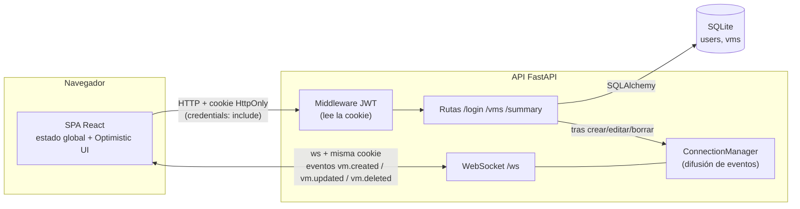

# VM Dashboard

Aplicación para gestionar máquinas virtuales (VMs): una SPA en React (`frontend/`) y una API REST en Python con FastAPI (`backend/`). Incluye login con JWT en cookie HttpOnly, roles **Administrador** y **Cliente**, CRUD de VMs y actualizaciones en tiempo real por WebSocket.

```
vm-dashboard/
├── backend/      # API FastAPI + SQLite (ver backend/README.md)
├── frontend/     # SPA React + Vite (ver frontend/README.md)
├── docker-compose.yml  # Levanta backend + frontend con Docker
└── render.yaml   # Despliegue en Render
```

## Despliegue local

Requisitos: Python 3.11 o superior y Node.js 20 o superior.

**1. Backend** (http://localhost:8000)

```bash
cd backend
python -m venv .venv
source .venv/bin/activate          # Windows: .venv\Scripts\activate
pip install -r requirements.txt
cp .env.example .env               # opcional; cambia VMD_JWT_SECRET
uvicorn app.main:app --reload
```

La primera vez se crea `vm_dashboard.db` (SQLite) con los usuarios de prueba y 10 VMs de ejemplo. La documentación interactiva queda en http://localhost:8000/docs.

**2. Frontend**

```bash
cd frontend
npm install
npm run dev
```

Abre la URL que muestra Vite en el navegador. La configuración del frontend (URL de la API, puerto) está en `frontend/README.md`.

**3. Tests del backend**

```bash
cd backend
pip install -r requirements-dev.txt
pytest
```

## Despliegue con Docker

Requisito: Docker con Docker Compose. Desde la raíz del repositorio:

```bash
docker compose up --build
```

- App: http://localhost:8080 (nginx sirve la SPA y reenvía `/api/*`, incluido el WebSocket, al backend; así la cookie sigue siendo de primera parte).
- API: http://localhost:8000/docs
- La base SQLite se guarda en el volumen `backend-data` y sobrevive a reinicios. `docker compose down -v` la borra y la siguiente vez se vuelven a crear los datos de ejemplo.

Cada carpeta tiene además su propio `docker-compose.yml` para levantarla sola: `backend/` publica la API en el puerto 8000 y `frontend/` sirve la SPA en el 8080 y espera la API en el puerto 8000 de la máquina.

En local todo va por http, así que los compose ponen `VMD_COOKIE_SECURE=false` (Safari, o entrar por la IP de la máquina, descartan cookies `Secure` sin HTTPS). Detrás de HTTPS se arranca con `VMD_COOKIE_SECURE=true docker compose up`, y `VMD_JWT_SECRET` debe tener un valor propio.

## Credenciales de prueba

| Rol | Email | Contraseña |
|---|---|---|
| Administrador | `admin@vmdashboard.com` | `admin123` |
| Cliente | `cliente@vmdashboard.com` | `cliente123` |

Las crea `backend/app/seed.py` al arrancar si la base está vacía. Se pueden cambiar con las variables `VMD_ADMIN_*` y `VMD_CLIENT_*`.

## Arquitectura



1. **Login:** la SPA envía email y contraseña a `POST /login`. La API responde con el usuario y su rol en el body y pone el JWT en una cookie `HttpOnly; Secure; SameSite`. El JavaScript de la página nunca ve el token.
2. **Peticiones:** el navegador envía la cookie solo en cada petición. El middleware JWT la valida y devuelve 401 si falta o caducó. Cada endpoint de escritura comprueba además el rol consultando la base de datos.
3. **Tiempo real:** al cargar el dashboard, la SPA abre `/ws` con la misma cookie. Cuando un Administrador crea, edita o borra una VM, la API guarda el cambio, responde y después envía el evento a todos los sockets conectados. Cada cliente actualiza su estado y resalta la tarjeta que cambió.

## Decisiones técnicas

**Backend**

- **FastAPI:** validación de datos con Pydantic, documentación OpenAPI automática en `/docs` y soporte nativo de WebSocket en el mismo servidor, sin servicio aparte.
- **JWT en cookie HttpOnly:** cumple el requisito de no exponer el token al JavaScript (protege frente a XSS). `SameSite=Lax` evita que otras webs envíen la cookie (CSRF). CORS solo permite los orígenes del frontend con `allow_credentials`.
- **Rol leído de la base de datos en cada petición**, no del token: un token manipulado no da permisos y un cambio de rol tiene efecto inmediato.
- **WebSocket con comprobación de `Origin`:** los WebSockets no pasan por CORS, así que se valida el origen a mano para evitar que otra web abra el socket con la sesión del usuario (Cross-Site WebSocket Hijacking).
- **SQLite + SQLAlchemy 2:** sin servidor de base de datos que instalar; cambiar a PostgreSQL es cambiar `VMD_DATABASE_URL`.
- **Login de tiempo constante:** si el email no existe se compara igualmente contra un hash, para no revelar qué emails están registrados.
- **Tests:** 42 tests con pytest cubren cookie, roles, validaciones, CRUD y tiempo real.

**Frontend**

Ver `frontend/README.md`: tecnologías elegidas y estructura de carpetas.

## Bitácora de IA

> Borrador: revísalo y complétalo con tus palabras antes de entregar. Las partes entre corchetes son tuyas.

**1. Herramientas utilizadas**

- Claude (Anthropic), en un proyecto de Claude con varias conversaciones: una para el backend y otra para el frontend.
- [Otras herramientas que hayas usado.]

**2. Qué delegué y dónde intervine**

- Delegué en la IA la generación del backend (FastAPI, modelos, autenticación, CRUD, WebSocket y tests) y del frontend.
- Intervine fijando las decisiones de arquitectura:
  - El stack: Python con FastAPI y SQLite.
  - Corregí el enfoque de autenticación: la primera versión devolvía el JWT en el body para guardarlo en localStorage, y exigí moverlo a una cookie HttpOnly, Secure y SameSite. La API se rehízo según la especificación.
  - Pedí revisar el backend contra el enunciado completo, lo que añadió el WebSocket, la validación del formato del nombre y el disco de las VMs activas en el resumen.
- [Qué revisaste o cambiaste tú en el código, cómo lo probaste.]

**3. Prompts clave**

Prompt con el que se corrigió la autenticación:

> "Requisito clave: El token JWT no debe ser devuelto en el body y guardado en el localStorage del frontend (práctica insegura). El backend debe configurar el JWT en una cookie HttpOnly, Secure y SameSite. El frontend debe manejar sus peticiones sabiendo que la cookie viaja automáticamente. POST /login: Valida email y password y establece la cookie HttpOnly. Retorna solo la información del usuario y su rol (Administrador o Cliente). [...]"

[Segundo prompt, por ejemplo el que usaste para el diseño de los componentes o las gráficas del frontend.]
